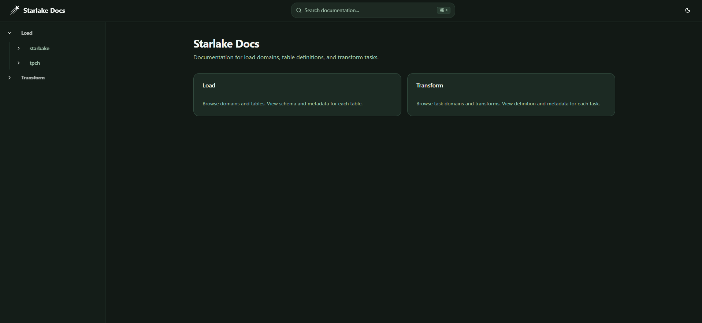
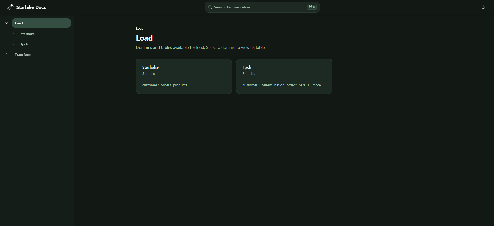
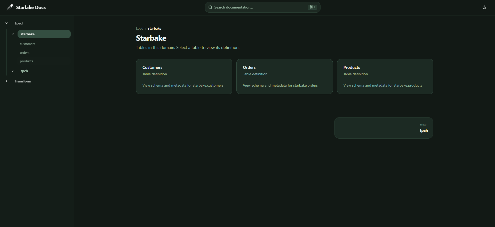
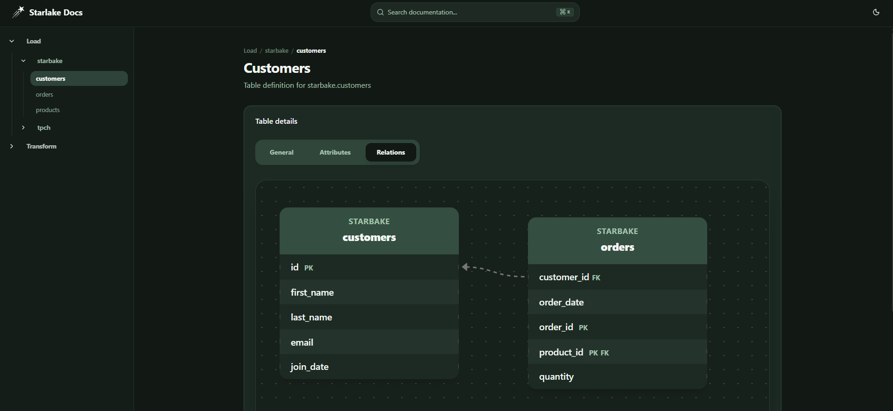
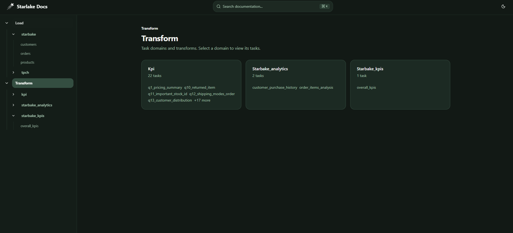
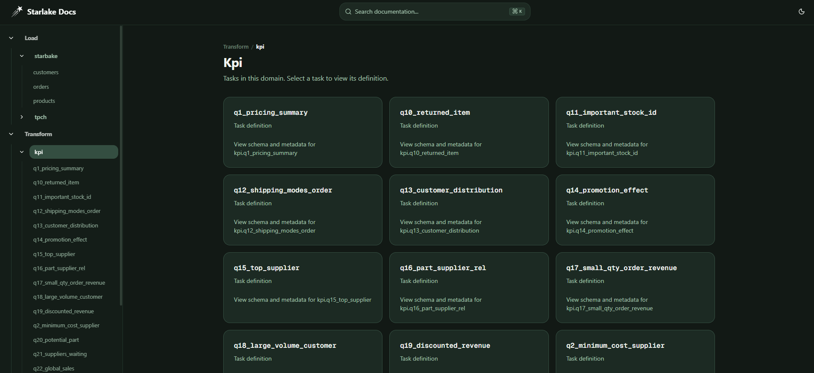
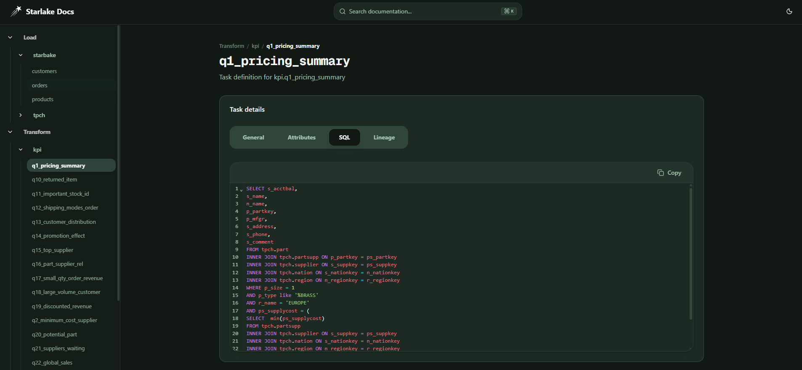

# Starlake Docs

> A modern documentation portal for Starlake load domains, table definitions, and transform tasks. Built with Next.js and designed for data teams who need clear, navigable documentation of their data models and transformations.

[](https://nextjs.org/)
[](https://www.typescriptlang.org/)
[](https://tailwindcss.com/)

---

## Screenshots

### Homepage

The main landing page gives you quick access to Load and Transform documentation.



### Load — Domains & Tables

Browse data domains and their tables. View schema, metadata, attributes, and relationships for each table.

| Domains overview | Domain tables | Table details (General) |
|------------------|---------------|--------------------------|
|  |  |  |

### Load — Table Schema & Relations

Inspect column definitions and visualize foreign key relationships with built-in ERD views.

| Attributes | Relations (ERD) |
|------------|-----------------|
|  |  |

### Transform — Task Domains & Definitions

Browse task domains and transformation tasks. View task metadata, output schema, SQL, and lineage.

| Task domains | Domain tasks | Task details |
|--------------|--------------|--------------|
|  |  |  |

### Transform — SQL & Data Lineage

View the full SQL definition for each task and explore upstream data dependencies with an interactive lineage diagram.

| SQL definition | Data lineage |
|----------------|--------------|
|  |  |

---

## Features

- **Load documentation** — Browse domains and tables from `tables/domains.json` and `tables/{domain}.{table}.json`
- **Transform documentation** — Explore task domains and transforms from `tasks/tasks.json` and `tasks/{domain}.{task}.json`
- **Table details** — General metadata, attributes (schema), and relations (ERD)
- **Task details** — General metadata, output attributes, SQL definition, and data lineage
- **Dark / light mode** — Theme toggle in the navbar
- **Responsive layout** — Collapsible sidebar with hamburger menu on small screens
- **Search** — Documentation search (⌘K / Ctrl+K)

---

## Getting Started

### Prerequisites

- Node.js 18+
- npm or pnpm

### Installation

1. Clone the repository:

```bash
git clone https://github.com/starlake-ai/starlake-site-builder.git
cd starlake-site-builder
```

2. Install dependencies:

```bash
npm install
```

3. Configure the path to your Starlake project in `.env.local`:

```env
SITE_BASE_PATH=/path/to/your/starlake-project
```

The app reads from `SITE_BASE_PATH` and expects:

- `tables/` — `domains.json` and `{domain}.{table}.json`
- `tasks/` — `tasks.json` and `{domain}.{task}.json`

4. Run the development server:

```bash
npm run dev
```

Open [http://localhost:3000](http://localhost:3000) in your browser.

---

## Project Structure

```
starlake-site-builder/
├── src/
│   ├── app/              # Next.js App Router pages
│   ├── components/       # React components
│   └── lib/              # Metadata loading, SEO config
├── docs/
│   └── screenshots/      # Documentation screenshots
└── public/
```

---

## Tech Stack

- [Next.js 16](https://nextjs.org/) (App Router)
- [TypeScript](https://www.typescriptlang.org/)
- [Tailwind CSS 4](https://tailwindcss.com/)
- [shadcn/ui](https://ui.shadcn.com/)
- [React Flow](https://reactflow.dev/) — lineage diagrams
- [CodeMirror](https://codemirror.net/) — SQL syntax highlighting
- [next-themes](https://github.com/pacocoursey/next-themes) — dark mode
